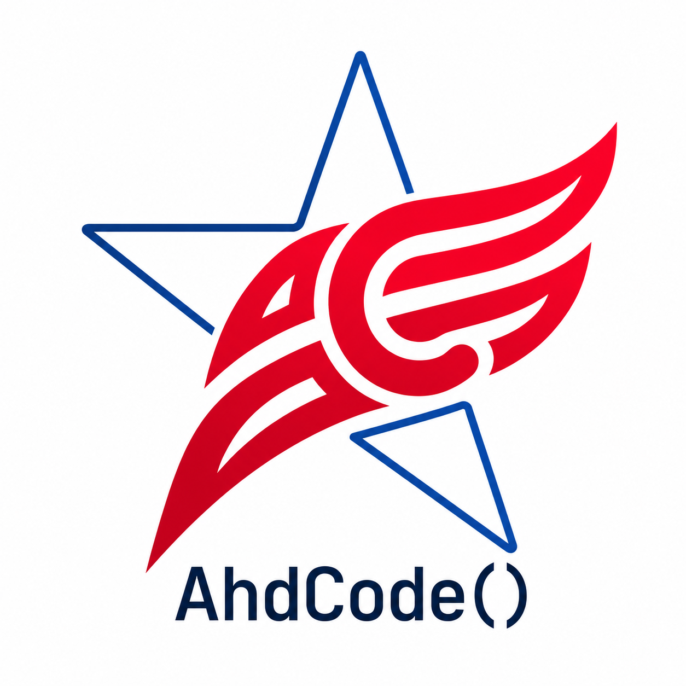

<p align="center">
  
</p>

# AhdCode

[](https://github.com/aliharundaldalli/AhdCode/actions/workflows/ci.yml)

[English](README.md) · [Türkçe](README_TR.md)

AhdCode is an experimental statically checked general-purpose programming
language focused on readable syntax, explicit intent, predictable semantics,
and native compilation.

The current release is **v0.15.1**. The core
language works end to end, but the project is not production-ready and
breaking changes may occur before 1.0.


**v0.16.0 candidate — Request Context, Forms, Validation, CSRF & Flash.**
The candidate adds an explicit request/session context, one-time response
finalization, typed form access, ordered validation errors, selected safe old
input, session-bound CSRF, and consumed flash messages. The implementation is
bundled AhdCode; existing HTTP/Session/Web.UI APIs and v0.15.1 clean routes remain
compatible. This is candidate work pending independent QA, not a new release.
See the [workflow and exact API](docs/WEB.md#16-v016-candidate-request-context-forms-validation-csrf-and-flash)
and the [runnable example](examples/v0.16/forms_validation/README.md).

v0.15.0, **Web Foundations**, adds [`Web`](docs/WEB.md): a first-party web
framework written mostly in AhdCode itself and bundled with the compiler, so
`bring Web` resolves offline with no package manager, registry, manifest, or
lockfile, and a built executable keeps no runtime dependency on framework
source. It composes the existing HTTP and HTML primitives rather than
replacing them and re-exports their types unchanged, so a `Request` reached
through `Web` *is* HTTP's `Request`.
[`Web.UI`](docs/WEB.md#9-webui) is a semantic HTML component layer — `section`,
`h1`, `p`, `a`, `img`, `table`, `form` and the rest — where every text entry
point escapes and there is no raw-markup helper anywhere.
Pages, Layouts, and Components are ordinary Functions returning `HTMLNode`:
no virtual DOM, no hydration, no template language, and no JavaScript runtime.
A frozen environment contract (`APP_NAME`, `APP_ENV`, `APP_HOST`,
`APP_PROTOCOL`, `SERVER_HOST`, `SERVER_PORT`) keeps the public URL and the
bind address separate for reverse-proxy deployments, with no silent defaults
and no `.env` values ever embedded in a binary. Still deliberately out of
scope: ORM, forms/validation, middleware, auth, bundler, and browser live
reload. Local trusted HTTPS for `<APP_HOST>.test` is
[deferred](docs/WEB.md#14-local-https--current-limitation) rather than
approximated: it would need permanently privileged system state.

v0.14.1 is a tooling hotfix for `require(...)` (language server, formatter,
and editor highlighting). Language semantics are unchanged from v0.14.0.

v0.14.0, **Application Foundations**, adds the remaining framework-independent
groundwork for larger server-side AhdCode applications: compile-time local
source composition with [`require(...)`](docs/REQUIRE.md), so a program can
be split across files without a package manager; `ahdcode dev` (v0.13) now
watches the entry file plus the whole resolved `require(...)` graph, not just
the entry, so editing any required file rebuilds and restarts automatically;
and [`server.static`](docs/HTTP.md#static-files) serves local static
assets (CSS, JS, SVG, images, fonts) from one explicit filesystem root with
path-traversal, symlink-escape, and dotfile protection built in, so every
application does not reimplement that itself. This is deliberately not a Web
framework release: no templating language, no forms/middleware/router
framework, no package manager, and no browser live reload.
[AhdDataStudio](tools/AhdDataStudio/README.md) is restructured onto these
foundations as its own dogfood, split from one file into files grouped by
responsibility, with no behavior change. v0.13.0 adds `ahdcode dev`: a
MAMP/Vite-style foreground watch-rebuild-restart loop built as orchestration
around the same build pipeline `ahdcode build`/`run` already use, plus
`ahdcode stop`, the graceful counterpart to the existing (forced-by-default)
`kill` — `stop` waits to confirm the process actually exited instead of
just signaling it. A failed rebuild always leaves the previously working
process running untouched, including the very first build; a runtime crash
after a successful build is reported without retrying the same binary.
v0.12.0 adds [AhdDataStudio](tools/AhdDataStudio/README.md): a first-party
localhost MySQL + SQLite development application written in AhdCode, not a
compiler builtin. Start it with `cd tools/AhdDataStudio && ahdcode run
app.ahd` and open
[http://127.0.0.1:8081/AhdDataStudio](http://127.0.0.1:8081/AhdDataStudio).
It binds `127.0.0.1` only, discovers MySQL schemas with `database: null`,
scopes SQLite files to configured project paths, and uses CSRF-protected
POST forms for generated CRUD. This release also fixes a parser hang on
malformed nested String literals. MySQL from v0.11 remains offline-buildable
through the bundled vendored driver. v0.11.0 adds [MySQL](docs/MYSQL.md): `MySQL.connect` dials a real server and
verifies it is reachable before returning, `database` may be `null` so a
connection can list every database the credentials can see with `SHOW
DATABASES` before selecting one, every query is server-side parameter-bound,
an independent `MySQLTransaction` never shares mutable state with concurrent
requests, and `DECIMAL`/binary values stay exact rather than being coerced.
The vendored `github.com/go-sql-driver/mysql` driver is embedded in AhdCode
itself and copied into a generated program's build as `vendor/`, so a
MySQL-using program still builds fully offline, the same guarantee every
other generated program already has. v0.10.0 adds [Security](docs/SECURITY.md): `Security.passwordHash` /
`passwordVerify` wrap Argon2id password hashing behind one self-describing
stored string, `Security.token` returns a 256-bit URL-safe random token, and
`Security.secureEqual` compares two Strings in constant time for CSRF tokens
and the like — three focused primitives, not an authentication framework.
v0.9.1 adds binary-safe [HTTP](docs/HTTP.md) file responses: `HTTP.file` and
`HTTP.download` stream a stored file's exact bytes back to the client
without ever passing them through an AhdCode `String`, with an explicit
`contentType` and, for `download`, a presentation filename that is
independent of the stored path and safely encoded even for non-ASCII names.
v0.9.0 adds send-only [SMTP](docs/SMTP.md) mail: an immutable `SMTPClient`
configures host, port, and security (`starttls`, `tls`, or explicit `none`),
an immutable `SMTPMessage` carries To/Cc/Bcc, Reply-To, UTF-8 Subject, and
text and/or HTML bodies, and `send` opens one SMTP connection per message
with AUTH PLAIN only after TLS. There is no IMAP, no attachments, no mail
queue, and no provider shortcut. v0.8.0 adds multipart form handling and safe file uploads: a handler reads
uploaded files with `Request.file` / `Request.files`, inspects
`originalName`, `size`, and both the declared and the content-sniffed MIME
type, and persists one with `UploadedFile.save(directory)` under a
crypto-random name the uploader cannot influence — so a hostile filename can
neither escape the directory nor overwrite an existing file. Uploaded bytes
are never an AhdCode `String` and never a database BLOB: applications store
the file on disk and keep only its path and metadata in
[SQLite](docs/SQLITE.md). It also adds `ahdcode kill app.run`, which stops an
application started with `ahdcode run` without looking up ports and pids by
hand. v0.7.0 adds HTML parsing and a small CSS-like selector language on top of the
existing [HTML](docs/HTML.md) builder: `HTML.parse(source)` turns an HTML
String -- typically an `HTTP` Client response body -- into a read-only
`HTMLDocument`, and `select`/`first` find `HTMLElement` values in it by tag,
id, class, attribute, and descendant/child combinators. Parsing never fetches
a network resource and never executes script content; it only tokenizes and
builds a tree. v0.6.0 adds an outbound [HTTP](docs/HTTP.md) Client with
HTTPS, timeouts, and explicit JSON/Env API interoperability. v0.5.0 added
HTTP cookies and
in-memory server-side sessions on top of the v0.4.0 web foundation: a typed
HTTP server, Request/Response values, and a small safe [HTML](docs/HTML.md)
builder, so an AhdCode program can be opened in a browser on this machine. A
session cookie holds only an opaque random identifier; session values stay on
the server and disappear when the process exits. This is not an authentication
framework. v0.3.0 began practical application development with a typed
[SQLite](docs/SQLITE.md) bridge. HTTP uses Go's `net/http` inside the runtime;
there is no companion HTTP, cookie, session, or client helper. Inbound
multipart uploads arrived in v0.8.0; outbound file attachments, WebSocket, and an AI
vendor module are still not part of the release.

v0.2.2 completed the practical everyday AhdCode language server on top of
v0.2.1's diagnostics, hover, completion, go to definition, document symbols,
signature help, and find references. v0.2.2 adds rename, semantic highlighting,
inlay hints, code actions/quick fixes, auto import, document formatting,
workspace symbol search, folding ranges, and selection ranges — all backed
directly by the real compiler frontend on unsaved editor buffers with full
document synchronization. See [`docs/LSP.md`](docs/LSP.md) for scope and
honest limitations (compile-graph-scoped references/rename, on-demand module
discovery, no persistent workspace index). The bundled
[VS Code extension](editors/vscode) launches the same server. Language
semantics are unchanged from v0.1.20, which added the [PDF](docs/PDF.md) and
[Archive](docs/ARCHIVE.md) modules and a `Latex.pdf` source sidecar.

```ahd
greet: Function := (
    name: String
) -> String {
    return "Hello {name}"
}

names: List<String> := ["Ali", "Ayşe"]

for name in names {
    write(greet(name))
}
```

## Why AhdCode?

- Declaration and mutation look different: `:=` declares, `=` mutates.
- Static checking rejects unrelated implicit conversions and truthiness.
- Explicit nullable types (`T?`) compose with collections, while flow-sensitive
  checks narrow proven non-null values.
- Lists, Pairs, Classes, Functions, modules, errors, and native executables are
  part of the v0.1 core.
- Expression-only `lambda (<typed parameters>) -> <expression>` creates a
  value of the existing `Function` type; it is not a separate callable type.
- A small, closed set of [Class Protocol Methods](docs/PROTOCOLS.md) lets a
  Class define `==`, ordering, arithmetic, unary `-`, and `str()` behavior.
- A [Regex module](docs/REGEX.md) compiles patterns to a `Pattern` value with
  `matches`, `find`, `findAll`, `groups`, `replace`, and `split`.
- [Time](docs/TIME.md) supports local, UTC, fixed-minute-offset, and Unix
  millisecond representations without introducing a timezone database.
- The strict [CSV module](docs/CSV.md) transports raw String rows or
  header-keyed String records with native and persistent-REPL parity.
- The [Data module](docs/DATA.md) adds an immutable `Table` of String cells for
  filtering, sorting, grouping, and deriving columns; it infers no types, so
  numeric work stays an explicit `int(...)` / `real(...)` conversion.
- An expression lambda may read outside values through an explicit dependency
  list: `#name`/`Local name` for a lexical capture, `@name`/`Global name` for a
  module binding, as in
  `lambda [#minimum, @Maximum] (score: Int) -> score >= minimum and score <= Maximum`;
  neither kind is ever inferred or implicit.
- The [Statistics module](docs/STATISTICS.md) provides typed descriptive
  statistics over `List<Int>` and `List<Real>`, with no String coercion.
- The [Numeric module](docs/NUMERIC.md) adds immutable Real-oriented vectors,
  matrices, linear algebra, and additive `Vector` overloads in Plot.
- The [Word module](docs/WORD.md) builds immutable formatted documents, merged
  tables, embedded Plot images, and bounded semantic DOCX read-back without
  requiring Office or an external runtime.
- The [Excel module](docs/EXCEL.md) reads and writes real `.xlsx` packages
  through typed immutable Workbook/Sheet/Cell/Range values. Formula intent is
  explicit, merges reject value loss, and native executables remain offline
  and relocation-safe.
- The [PDF module](docs/PDF.md) builds immutable `PDFDocument` values and
  renders them offline to real `.pdf` files through the same staged Tectonic
  renderer `Latex` uses, plus semantic `PDF.fromWord`/`PDF.fromExcel`
  conversion of another module's own typed document.
- The [Archive module](docs/ARCHIVE.md) packages files into real ZIP, TAR,
  and TAR.GZ archives offline, creation-only, using nothing beyond the Go
  standard library.
- [Lists](docs/LISTS.md) and [KeyValue](docs/KEYVALUE.md) add pure structural
  transformations of `List` and `Pair` — `chunk`, `flatten`, `transpose`,
  `unique`, `valueCounts`, `groupBy`, and `keys`, `values`, `combine`, `with`,
  `select`, `drop`, `rename`, `mapValues`, `merge`, `overlay`. They are
  type-directed: each call's exact result type is computed from its argument
  types, with no generic syntax and nothing erased.
- The formatter defines one canonical presentation while preserving comments.
- The [language server](docs/LSP.md) (`ahdcode lsp`) exposes the compiler's
  own diagnostics, hover, go to definition, document symbols, signature
  help, find references, and completion over standard stdio LSP -- no
  second parser, no hand-maintained symbol catalog, and no writes to a
  document's file while it's open and unsaved in an editor.

## Build from source

AhdCode currently requires Go 1.25 or newer.

```bash
cd AhdCode
go test ./...
go install ./cmd/ahdcode ./cmd/ahdnumeric ./cmd/ahdplot ./cmd/ahdsqlite
```

The command above installs the compiler and the local numeric, plot, and SQLite helpers.
If you plan to use the `Latex` module **or** the `PDF` module's `.save()` (they
share one offline renderer), you must also stage the offline Latex/Tectonic
runtime bundle. `Archive` needs no such staging -- it is Go-standard-library
only. Staging requires a one-time network fetch to download pinned,
checksummed resources:

```bash
go run ./tooling/latex/cmd/package-latex --output "$(go env GOPATH)"
```

After staging, ordinary AhdCode Latex execution remains strictly offline.

Ensure Go's binary directory is on `PATH`:

```bash
export PATH="$(go env GOPATH)/bin:$PATH"
ahdcode --version
```

## CLI quick start

```bash
ahdcode run examples/v0.1/01_hello.ahd
ahdcode dev examples/v0.1/01_hello.ahd
ahdcode build examples/v0.1/01_hello.ahd -o hello
ahdcode format examples/v0.1/01_hello.ahd
ahdcode format --check examples/v0.1/01_hello.ahd
ahdcode
```

See the [CLI guide](docs/CLI.md), [formatter guide](docs/FORMATTER.md),
[REPL guide](docs/REPL.md), and [language server guide](docs/LSP.md).

## Documentation

- [Türkçe Öğrenci Rehberi](docs/STUDENT_GUIDE_TR.md)
- [English Student Guide](docs/STUDENT_GUIDE_EN.md)
- [Web — the first-party web framework](docs/WEB.md)
- [require(...) — local source composition](docs/REQUIRE.md)
- [Practical Module Workshops](docs/PRACTICAL_MODULES.md) — learn CSV, Data,
  Plot, Excel, Word, Latex, HTTP(S), and HTML through end-to-end projects
- [Getting started](docs/GETTING_STARTED.md)
- [Language tour](docs/LANGUAGE_TOUR.md)
- [Types and null safety](docs/TYPES_AND_NULL.md)
- [Control flow](docs/CONTROL_FLOW.md)
- [Functions](docs/FUNCTIONS.md)
- [Classes](docs/CLASSES.md)
- [Class Protocol Methods](docs/PROTOCOLS.md)
- [Collections](docs/COLLECTIONS.md)
- [Modules](docs/MODULES.md)
- [Errors](docs/ERRORS.md)
- [Fundamentals](docs/FUNDAMENTALS.md)
- [String API](docs/STRING_API.md)
- [List API](docs/LIST_API.md)
- [Math module](docs/MATH.md)
- [Time module](docs/TIME.md)
- [Latex module](docs/LATEX.md)
- [Word module](docs/WORD.md)
- [Excel module](docs/EXCEL.md)
- [PDF module](docs/PDF.md)
- [Archive module](docs/ARCHIVE.md)
- [File and Path modules](docs/FILESYSTEM.md)
- [Regex module](docs/REGEX.md)
- [CSV module](docs/CSV.md)
- [Data module](docs/DATA.md)
- [Statistics module](docs/STATISTICS.md)
- [Plot module](docs/PLOT.md)
- [Numeric module and Complex scalars](docs/NUMERIC.md)
- [JSON module](docs/JSON.md)
- [SQLite module](docs/SQLITE.md)
- [HTTP module](docs/HTTP.md)
- [HTML module](docs/HTML.md)
- [SMTP module](docs/SMTP.md)
- [XML module](docs/XML.md)
- [Env module](docs/ENV.md)
- [Lists module](docs/LISTS.md)
- [KeyValue module](docs/KEYVALUE.md)
- [Understanding diagnostics](docs/DIAGNOSTICS.md)
- [Language server](docs/LSP.md)
- [AI-assisted local setup](FOR_AI.md)
- [Curated v0.1 examples](examples/v0.1/README.md)
- [v0.3 SQLite Notes App](examples/v0.3/README.md)
- [v0.4 Web Notes App](examples/v0.4/README.md)
- [v0.5 cookies and sessions](examples/v0.5/README.md)
- [v0.6 HTTP Client](examples/v0.6/README.md)
- [v0.7 HTML parsing and web scraping](examples/v0.7/README.md)
- [v0.8 multipart forms and file uploads](examples/v0.8/README.md)
- [v0.9 SMTP mail sending](examples/v0.9/README.md)
- [v0.12 MySQL raffle](examples/v0.12/raffle/README.md) — join codes, hashed admin login, announced winner
- [v0.14 multi-file web example](examples/v0.14/multi_file_web/README.md) — require(...), dependency-aware dev, static assets
- [AhdDataStudio](tools/AhdDataStudio/README.md) — local MySQL + SQLite development UI
- [v0.4 Library Demo](https://github.com/aliharundaldalli/ahdcode-library-demo) (separate beginner web app)
- [v0.4 Seminar Demo](https://github.com/aliharundaldalli/ahdcode-seminer-demo) (Hatay, multi-page)
- [v0.15 Math Portal](https://github.com/aliharundaldalli/ahdcode-math-portal) (Web.UI, MySQL, sessions, CSRF)
- [Full v0.1 language specification](AHDCODE_LANGUAGE_SPEC_v0.1.md)

## Editor extension

The local VS Code-compatible extension in [`editors/vscode`](editors/vscode)
recognizes `.ahd`, provides syntax highlighting, runs the active file from
the editor title play button, Command Palette, or `F6`, and connects to the
[language server](docs/LSP.md) (`ahdcode lsp`) for compiler-backed
diagnostics and hover. The same VSIX targets VS Code and Antigravity. See its
[installation guide](editors/vscode/README.md).

## Current limitations

v0.1 intentionally has no block/statement lambdas, implicit/general mutable closure cells, tuple
returns, reflection, interfaces, multiple inheritance, debugger, package
search paths, or web runtime. The [language server](docs/LSP.md) has no
rename or semantic tokens yet, and find references is scoped to one
document's own compile graph rather than a full workspace-wide index.
Operator behavior is user-definable only through the ten fixed
[Class Protocol Methods](docs/PROTOCOLS.md), not a general overloading
mechanism. Modules are sibling `.ahd` files, and the editor extension is a
lightweight run-and-highlight integration. See the
[specification's unsupported-feature list](AHDCODE_LANGUAGE_SPEC_v0.1.md#40-unsupported-v01-features).

## Repository map

```text
cmd/ahdcode/       CLI entry point
cmd/ahdnumeric/    bundled advanced linear-algebra helper
cmd/ahdplot/       bundled chart-rendering helper
cmd/ahdsqlite/     bundled CGO-free SQLite helper
internal/          compiler, runtime, formatter, and REPL
editors/vscode/    VS Code / Antigravity extension
docs/              end-user guides
examples/v0.1/     curated working programs
examples/v0.3/     SQLite Notes App
examples/v0.4/     Web Notes App
examples/v0.5/     cookies and in-memory sessions
examples/v0.6/     outbound HTTP Client and JSON APIs
examples/v0.7/     HTML parsing, selectors, and web scraping
examples/v0.8/     multipart forms, file uploads, and upload metadata
examples/v0.9/     SMTP text/HTML mail through Env-configured servers
examples/v0.12/    MySQL raffle demo (join codes and announced winner)
tools/AhdDataStudio/ first-party local MySQL + SQLite development UI
AHDCODE_LANGUAGE_SPEC_v0.1.md
                   authoritative language contract
```

## Development and credits

AhdCode is designed and specified by Ali Harun Daldallı. Implementation,
documentation, and testing have been developed with extensive AI assistance,
including OpenAI Codex, Anthropic Claude, and Google Gemini. Their roles vary
by task; language design and final technical decisions remain with the project
author.

## License

AhdCode is available under the [MIT License](LICENSE).
