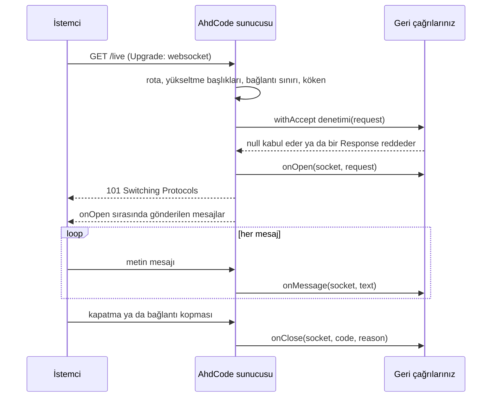

# WebSocket

[English](WEBSOCKET.md) · [Türkçe]

[README'ye dön](../README_TR.md) · [HTTP](HTTP_TR.md) · [Web](WEB_TR.md) · [Security](SECURITY_TR.md) · [Env](ENV_TR.md)

AhdCode v1.4.0, [HTTP](HTTP_TR.md) modülüne WebSocket **sunucu** uç noktaları
ekler; [Web](WEB_TR.md) de bunları küçük bir geçişle sunar. Bir uç nokta
rotalarınızla aynı `Server` üzerinde yaşar, onun işleyici kilidini ve yaşam
döngüsünü paylaşır ve tarayıcılarla ya da diğer istemcilerle metin mesajları
alışverişi yapar.

v2.1 diğer ucu ekler: eşzamanlı bir WebSocket **istemcisi**. Böylece bir
AhdCode programı yalnızca hizmet vermekle kalmaz, bir servise bağlanabilir
de. Ayrı bir tür çiftidir ve sunucu tarafında hiçbir şeyi değiştirmez; bkz.
[İstemci](#istemci).

Protokolü AhdCode'a gömülü `github.com/coder/websocket` v1.8.15 uygular.
Yalnızca uç nokta ya da istemci oluşturan bir program bu kodu alır ve
derleme her iki durumda da çevrimdışı kalır.

## Genel arayüz

```text
HTTP.websocket(onMessage: Function(WebSocket, String) -> Nothing) -> WebSocketEndpoint

WebSocketEndpoint.withOpen(handler: Function(WebSocket, Request) -> Nothing)      -> WebSocketEndpoint
WebSocketEndpoint.withClose(handler: Function(WebSocket, Int, String) -> Nothing) -> WebSocketEndpoint
WebSocketEndpoint.withAccept(check: Function(Request) -> Response?)               -> WebSocketEndpoint
WebSocketEndpoint.withAllowedOrigins(origins: List<String>)                       -> WebSocketEndpoint
WebSocketEndpoint.withMaxMessageBytes(bytes: Int)                                 -> WebSocketEndpoint
WebSocketEndpoint.withMaxQueuedMessages(count: Int)                               -> WebSocketEndpoint
WebSocketEndpoint.withMaxConnections(count: Int)                                  -> WebSocketEndpoint

Server.websocket(path: String, endpoint: WebSocketEndpoint) -> Nothing

WebSocket.id()                                           -> String
WebSocket.send(text: String)                             -> Bool
WebSocket.close(code: Int := 1000, reason: String := "") -> Nothing
WebSocket.isOpen()                                       -> Bool

Web.websocket(onMessage: Function(WebSocket, String) -> Nothing) -> WebSocketEndpoint
App.websocket(path: String, endpoint: WebSocketEndpoint)         -> Nothing
```

İstemci (v2.1):

```text
HTTP.webSocketClient(url: String) -> WebSocketClient

WebSocketClient.withHeader(name: String, value: String) -> WebSocketClient
WebSocketClient.withTimeout(seconds: Int)               -> WebSocketClient
WebSocketClient.withMaxMessageBytes(bytes: Int)         -> WebSocketClient
WebSocketClient.connect()                               -> WebSocketConnection

WebSocketConnection.send(text: String)                             -> Bool
WebSocketConnection.receive(timeoutSeconds: Int := 0)              -> String?
WebSocketConnection.close(code: Int := 1000, reason: String := "") -> Nothing
WebSocketConnection.isOpen()                                       -> Bool
WebSocketConnection.closeCode()                                    -> Int?
WebSocketConnection.closeReason()                                  -> String
```

`Web`, `WebSocket` ve `WebSocketEndpoint` türlerini yeniden dışa aktarır. Bir
`WebSocketEndpoint`, `Cookie` gibi değiştirilemez bir yapılandırmadır: her
`with…` yenisini döndürür ve canlı bağlantı tutmaz. `WebSocket.id()`, süreç
içinde benzersiz olan ve asla yeniden kullanılmayan opak bir kimliktir.

## İlk uç nokta

```ahd
bring HTTP
bring KeyValue
from HTTP bring (Server, Request, WebSocket, WebSocketEndpoint)

clients: Pair<String, WebSocket> := {}

joined: Function := (socket: WebSocket, request: Request) -> Nothing {
    clients: Global Pair<String, WebSocket>
    clients[socket.id()] = socket
}

received: Function := (socket: WebSocket, text: String) -> Nothing {
    socket.send("echo: " + text)
}

left: Function := (socket: WebSocket, code: Int, reason: String) -> Nothing {
    clients: Global Pair<String, WebSocket>
    clients = KeyValue.without(clients, socket.id())
}

endpoint: WebSocketEndpoint := HTTP.websocket(received)
endpoint = endpoint.withOpen(joined)
endpoint = endpoint.withClose(left)

server: Server := HTTP.server("127.0.0.1", 8172)
server.websocket("/live", endpoint)
server.start()
```

Uç noktaları `start()` çağrısından önce kaydedin. Bir yol hem WebSocket uç
noktası hem de `GET` rotası olamaz; iki hata da `HTTPError` verir. Uç nokta
yoluna gelen `GET` dışındaki bir istek `Allow` başlığıyla `405` alır.

## Yaşam döngüsü



Açılış el sıkışması denetimlerini bu sırayla yapar:

1. Yol bir uç noktayla eşleşir; kurallar HTTP rotalarıyla aynıdır.
2. Yükseltme başlıkları. Yükseltme denemesi olmayan bir istek
   `426 Upgrade Required`, bozuk bir deneme `400` alır.
3. Bağlantı sınırı. Sınıra ulaşıldığında: `503`.
4. Köken (origin) politikası. Başarısız olursa: `403`.
5. Varsa `withAccept` denetimi. Döndürülen bir `Response` olduğu gibi
   gönderilir ve yükseltme yapılmaz; `null` devam eder. Denetimde oluşan bir
   hata `500` olur ve işleyici hatası gibi günlüğe yazılır.
6. `onOpen(socket, request)`. Yükseltme yanıtından **önce** çalışır; yani
   istemci bağlantıyı açık gördüğünde `onOpen` dönmüş ve soket kaydınıza
   eklenmiştir. `onOpen` içinden gönderilen mesajlar ilk olarak iletilir.
7. `101 Switching Protocols`. `onOpen` sonrasında yükseltme başarısız olursa
   `onClose(socket, 1006, "")` yine çalışır.

Her soket için `onOpen` tam bir kez ve ilk olarak, `onMessage` her mesaj için
geliş sırasıyla bir kez, `onClose` ise tam bir kez ve son olarak çalışır.
Reddedilen bir el sıkışma bunların hiçbirini çalıştırmaz.

## Geri çağrılar birer birer çalışır

Her WebSocket geri çağrısı HTTP işleyicileriyle **aynı** sunucu başına kilidi
tutar. Bir `Server` üzerindeki iki işleyici ya da geri çağrı asla aynı anda
çalışmaz. Yukarıdaki kaydın kilitsiz, sıradan bir `Pair` olabilmesinin nedeni
budur.

Bu aynı zamanda yavaş bir geri çağrının, yavaş bir işleyici gibi, her isteği ve
diğer her soketi beklettiği anlamına gelir. Geri çağrıları kısa tutun. Geri
çağrı içinde bir veritabanı sorgusu sorun değildir; yavaş bir şeyi beklemek
sorundur.

Bir istemcinin sonraki mesajı ancak önceki mesajın `onMessage` çağrısı
döndükten sonra okunur; böylece yavaş bir uygulama gizli bir kuyruk büyütmek
yerine o istemciyi yavaşlatır.

## Gönderme ve yayınlama

`send` hiç beklemez. Mesajı o soketin sınırlı kuyruğuna koyar ve `true`
döndürür; soket kapalıysa ya da kapanıyorsa `false` döndürür. Kuyruk dolunca
soket `1008` kodu ve `outbound queue full` nedeniyle kapatılır ve `send`
`false` döndürür: yetişemeyen bir istemcinin belleği büyütmesine izin
verilmez, bağlantısı kesilir.

Yayınlama, kendi kaydınız üzerinde çalışan uygulama kodudur:

```ahd
broadcast: Function := (text: String) -> Int {
    clients: Global Pair<String, WebSocket>
    delivered: Local Int := 0
    for socket in KeyValue.values(clients) {
        if socket.send(text) {
            delivered += 1
        }
    }
    return delivered
}
```

Bir HTTP işleyicisi aynı kilidi tuttuğu için `broadcast` çağırabilir.

## Mesajlar

- Yalnızca metin mesajları desteklenir. İkili bir mesaj soketi `1003` ile
  kapatır.
- Metin geçerli UTF-8 olmalıdır; değilse soket `1007` ile kapanır.
- `maxMessageBytes` değerinden büyük bir mesaj soketi `1009` ile kapatır.
  Parçalı mesajlar bu sınıra kadar birleştirilir.
- Mesaj içerikleri asla günlüğe yazılmaz.

Yapılandırılmış veri göndermek için onu [JSON](JSON_TR.md) ile oluşturup
String olarak gönderin.

## Kapatma

`close(code, reason)`, `1000`, `1001`, `1008`, `1011` ve `3000..4999` kodlarını
en fazla 123 baytlık UTF-8 bir nedenle kabul eder; başka her şey `HTTPError`
verir. Zaten kapalı ya da kapanmakta olan bir soketi kapatmak hiçbir şey
yapmaz. Kuyrukta bekleyen mesajlar kapatma çerçevesinden önce gönderilir. Bir
geri çağrı içindeki `close`, `onClose`'u o geri çağrının içinden çağırmaz;
`onClose` mevcut geri çağrı döndükten sonra çalışır. Kapatma el sıkışması en
fazla beş saniye bekler.

`onClose`, önce kapatan tarafın kodunu ve nedenini alır. Kopan bir bağlantı,
ping zaman aşımı ya da takılan bir yazma boş bir nedenle `1006` bildirir;
`1006` hiçbir zaman ağ üzerinden gönderilmez. `onClose` başladıktan sonra
`isOpen()` `false` olur ve `send` `false` döndürür.

`onOpen` ya da `onMessage` içinde oluşan bir hata istemciye değil stderr'e
yazılır; soket `1011` ile kapatılır ve `onClose` yine çalışır. `onClose`
içindeki bir hata yalnızca günlüğe yazılır. Sunucu hizmet vermeye devam eder.
Bir bağlantı kopması `HTTPError` değildir.

Sürecin sonlanması — Ctrl+C, `ahdcode kill` ya da bir `dev` yeniden
derlemesi — bağlantıları kapatma çerçevesi göndermeden düşürür. İki tarafta
da otomatik yeniden bağlanma yoktur: bir tarayıcı sayfası ancak kendi betiği
yaparsa yeniden bağlanır.

## Bağlantıları canlı tutma

Sunucu her bağlantıya 30 saniyede bir ping gönderir. 30 saniye içinde yanıt
vermeyen bir istemci `1006` olarak kapatılır. İstemci pingleri yanıtlanır.
Giden her mesajın 10 saniyelik bir yazma süresi sınırı vardır. HTTP
sunucusunun kendi okuma ve yazma zaman aşımları yükseltilmiş bir bağlantıya
uygulanmaz; soket, istemci açık tuttuğu sürece açık kalır.

## Güvenlik

### Kökenler

Tarayıcılar bir `Origin` başlığı gönderir ve başka bir sitedeki sayfa, uç
noktanızı kullanıcının çerezleriyle açmayı deneyebilir. Varsayılan politika
aynı kökendir:

- `Origin` başlığı olmayan isteğe izin verilir; bu tarayıcı olmayan bir
  istemcidir.
- Aksi hâlde, varsayılan olmayan port dahil `Origin` ana makinesi, büyük küçük
  harf ayrımı yapılmadan isteğin `Host` değerine eşit olmalıdır.

`withAllowedOrigins(["https://app.example.com"])`, varsayılanı küçük harfe
çevrildikten sonra karşılaştırılan tam `scheme://host[:port]` değerleri
listesiyle değiştirir. Joker karakter ve yol yoktur; `"*"`, boş liste ya da
bozuk bir köken yapılandırma sırasında `HTTPError` verir.

### Kimlik doğrulama

Yükseltmeden önce `withAccept` ile kimlik doğrulayın:

```ahd
accept: Function := (request: Request) -> Response? {
    session: Local Session := sessions.open(request)
    if session.get("user_id") == null {
        return HTTP.text("sign in first", 401)
    }
    return null
}
endpoint = endpoint.withAccept(accept)
```

Oturumlar `withAccept` ve `onOpen` içinde okunabilir. Orada kaydedilecek bir
yanıt olmadığından, bu geri çağrılarda oturumu değiştirmek desteklenmez.
Makineden makineye kullanım için `request.header("Authorization")`,
[`Env.secret`](ENV_TR.md) ve [`Security.secureEqual`](SECURITY_TR.md) ile
denetlenen bir bearer token aynı şekilde çalışır.

### Sınırlar

| Ayar | Varsayılan | Aralık | Aşıldığında |
| --- | --- | --- | --- |
| `withMaxMessageBytes` | 65536 | `1..16777216` | `1009` ile kapatma |
| `withMaxQueuedMessages` | 64 | `1..4096` | `1008`, `outbound queue full` ile kapatma |
| `withMaxConnections` | 1024 | `1..1000000` | el sıkışmada `503` |

Aralık dışındaki bir değer `HTTPError` verir. Sıkıştırma kapalıdır.

## Web ile kullanım

```ahd
bring Web
from Web bring (App, WebSocket)

echo: Function := (socket: WebSocket, text: String) -> Nothing {
    socket.send(text)
}

site: App := Web.start()
site.websocket("/live", Web.websocket(echo))
site.start()
```

`App.websocket`, uç noktayı uygulamanın sunucusuna rotalarıyla aynı
yapılandırma ve sınırlar altında kaydeder. Uç noktalar bir `RouteSet` ya da
`RouteGroup` üzerine kaydedilemez: korumalar ve `RequestContext.respond` bir
HTTP yanıtı üretir ve yükseltilmiş bir bağlantı bunu kullanamaz. Aynı politikayı
`withAccept` içine yazın.
[Gerçek zamanlı yoklama örneği](../examples/v1.4/realtime_attendance/README_TR.md)
eksiksiz bir uygulama gösterir.

## Ters vekil arkasında

Bir ters vekil yükseltmeyi geçirmeli ve aynı köken denetiminin karşılaştırdığı
özgün `Host` başlığını korumalıdır.

nginx:

```nginx
location /live {
    proxy_pass http://127.0.0.1:8140;
    proxy_http_version 1.1;
    proxy_set_header Upgrade $http_upgrade;
    proxy_set_header Connection "upgrade";
    proxy_set_header Host $host;
    proxy_read_timeout 120s;
}
```

Caddy'nin `reverse_proxy` yönergesi WebSocket yükseltmelerini ek ayar olmadan
geçirir. Vekilin boşta kalma zaman aşımını 30 saniyelik ping aralığının
üzerinde tutun. TLS vekilde sonlanıyorsa tarayıcılar vekile `wss://` ile
bağlanır.

## İstemci

v2.1, bir AhdCode programının bir WebSocket bağlantısının diğer ucu
olmasına izin verir.

İstemci bilinçli olarak sunucunun `WebSocket` değeri **değildir**. Bir
`WebSocketClient` arkasında soket olmayan, değiştirilemez bir
yapılandırmadır; bir `WebSocketConnection` ise `connect()`'in ürettiği tek
bir canlı bağlantıdır. İkisini ayrı tutmak, bir programın hiç çevrilmemiş
bir şey üzerinde `receive` çağırmasını imkânsız kılar ve derleyici bunu
söyler.

```ahd
bring HTTP
from HTTP bring (WebSocketClient, WebSocketConnection, HTTPError)

socket: WebSocketClient := HTTP.webSocketClient("ws://127.0.0.1:8138/live")
authorized: WebSocketClient := socket.withHeader("Authorization", "Bearer token")
live: WebSocketConnection := authorized.withTimeout(5).connect()

if live.send("merhaba") {
    reply: String? := live.receive(5)
    if reply != null {
        write(reply)
    }
}
live.close()
```

### Bağlanma

`HTTP.webSocketClient(url)` hiçbir ağ işlemi yapmaz: URL'yi doğrular ve
yapılandırmayı saklar. Her `with…`, tıpkı `WebSocketEndpoint` gibi yeni bir
`WebSocketClient` döndürür. Yalnızca `connect()` bağlantı açar ve
açamadığında `HTTPError` fırlatır.

URL `ws://` ya da `wss://` olmalıdır. `http://` ve `https://` sessizce
dönüştürülmek yerine reddedilir; böylece program hangi protokolü
kastettiğini söyler. `file:`, parça (fragment), userinfo ve bozuk URL'ler de
reddedilir.

`withTimeout(seconds)` açılış el sıkışmasını ve sonraki her `send` işlemini
sınırlar; varsayılanı 30 saniyedir. `withMaxMessageBytes(bytes)` gelen tek
bir mesajı sınırlar; varsayılanı `65536`, aralığı `1..16777216`'dır — sunucu
uç noktasıyla aynı, böylece bir bağlantının iki ucu aynı şekilde
yapılandırılır.

`withHeader`, `Authorization` gibi bir el sıkışma başlığı koyar. Zaten var
olan bir başlığı koymak, tıpkı `ClientRequest.withHeader` gibi onu
değiştirir; çağrıyı yinelemek başlığı iki kez göndermez. Protokolün sahip
olduğu başlıklar — `Connection`, `Upgrade`, `Host`, `Content-Length` ve her
`Sec-WebSocket-*` — reddedilir: bunlardan birini koymak ya yok sayılır ya da
yükseltmeyi bozar. Başlık değerindeki CR ve LF, her yerde olduğu gibi
reddedilir.

### Alma

`receive` eşzamanlıdır. Geri çağrı, arka plan olay veri yolu ya da async bir
API yoktur: program sıradaki mesajı ister ve bekler.

```text
receive()                  bir mesaj gelene ya da karşı taraf kapatana kadar bekler
receive(timeoutSeconds)    en çok o kadar saniye bekler
```

- bir metin mesajı o `String`'i döndürür
- karşı tarafın normal kapatması `null` döndürür; `closeCode()` ve
  `closeReason()` bunu anlatır
- kopan bir bağlantı, bir protokol sorunu ya da **dolan bir zaman aşımı**
  `HTTPError` fırlatır

Zaman aşımı `null` döndürmek yerine hata fırlatır; böylece bir program
"henüz bir şey gelmedi" ile "karşı taraf kapattı" durumlarını her zaman ayırt
edebilir. Bağlantı zaman aşımından sonra açık kalır ve sonraki bir `receive`
mesajı yine alır.

Mesajlar, karşı tarafın gönderdiği sırayla gelir. Sonraki çerçeve ancak
önceki mesaj alındıktan sonra okunur; böylece yavaş bir program kuyruk
büyütmek yerine karşı tarafı yavaşlatır.

### Gönderme ve kapatma

`send(text)` tam bir UTF-8 metin mesajı gönderir. Bağlantı zaten kapalı ya
da kapanıyorsa `false` döndürür; yazmanın kendisi başarısız olursa
`HTTPError` fırlatır — kopan bir bağlantı asla teslim edilmiş bir mesaj gibi
bildirilmez. Gizli bir yeniden deneme ve otomatik yeniden bağlanma yoktur:
yeniden bağlanmak programın kararıdır ve programda yazılır.

`close(code, reason)` sunucunun kapanış kodu politikasını izler: `1000`,
`1001`, `1008`, `1011` ya da `3000..4999` ve en çok 123 baytlık UTF-8 bir
neden. Zaten kapalı bir bağlantıyı kapatmak hiçbir şey yapmaz.

`closeCode()`, bağlantı açıkken `null`'dur; sonra onu sonlandıran koddur: bu
program kapattıysa gönderdiği kod, aksi hâlde karşı tarafınki ya da bağlantı
koptuysa `1006`. `closeReason()` ona karşılık gelen nedendir ya da `""`.

### Yalnızca metin

İstemci de sunucu gibi yalnızca metin taşır. Gelen ikili bir mesaj bağlantıyı
`1003` ile kapatır ve `HTTPError` fırlatır; `maxMessageBytes` sınırını aşan
bir mesaj `1009` ile kapatır ve fırlatır; geçerli UTF-8 olmayan bir metin
mesajı `1007` ile kapatır ve fırlatır. `send` yalnızca `String` kabul eder.
`Bytes` tipi ve ikili çerçeve API'si yoktur.

### TLS

`wss://`, sertifikayı ve konak adını sistem kökleriyle doğrular; tıpkı HTTP
istemcisinin `https://` yaptığı gibi. `insecureSkipVerify`, özel CA ya da
istemci sertifikası API'si yoktur; güvenilmeyen, kendinden imzalı ya da
süresi dolmuş bir sertifika `HTTPError` fırlatır.

Bir hata hiçbir zaman el sıkışma başlığını adlandırmaz: ileti hangi aşamanın
başarısız olduğunu söyler, isteğin ne taşıdığını değil; böylece bir
`Authorization` değeri günlüğe düşemez. WebSocket'in HTTP yönlendirme
politikası yoktur, bu yüzden hiçbir kimlik bilgisi başka bir konağa
iletilmez.

### Ping, pong ve canlı tutma

Denetim çerçeveleri gömülü kütüphanenin içinde işlenir. İstemcide genel bir
ping, pong ya da kalp atışı API'si yoktur ve gerekmez.

## Hedef dışı olanlar

İki uçta da hâlâ yok: ikili mesajlar, alt protokoller, sıkıştırma,
`RouteSet` / `RouteGroup` üzerinde uç noktalar, kapanışta nazik bir `1001`,
otomatik yeniden bağlanma ve yayınla/abone ol ya da olay veri yolu katmanı.
İstemci; geri çağrı, arka plan olay döngüsü ya da bağlantı havuzu eklemez.

Ayrıca bakın: [`examples/v0.1/72_websocket_echo.ahd`](../examples/v0.1/72_websocket_echo.ahd) ·
[`examples/v1.4/realtime_attendance`](../examples/v1.4/realtime_attendance/README_TR.md) ·
[`examples/v2.1/websocket_client`](../examples/v2.1/websocket_client/) ·
[HTTP](HTTP_TR.md) · [Web](WEB_TR.md).
