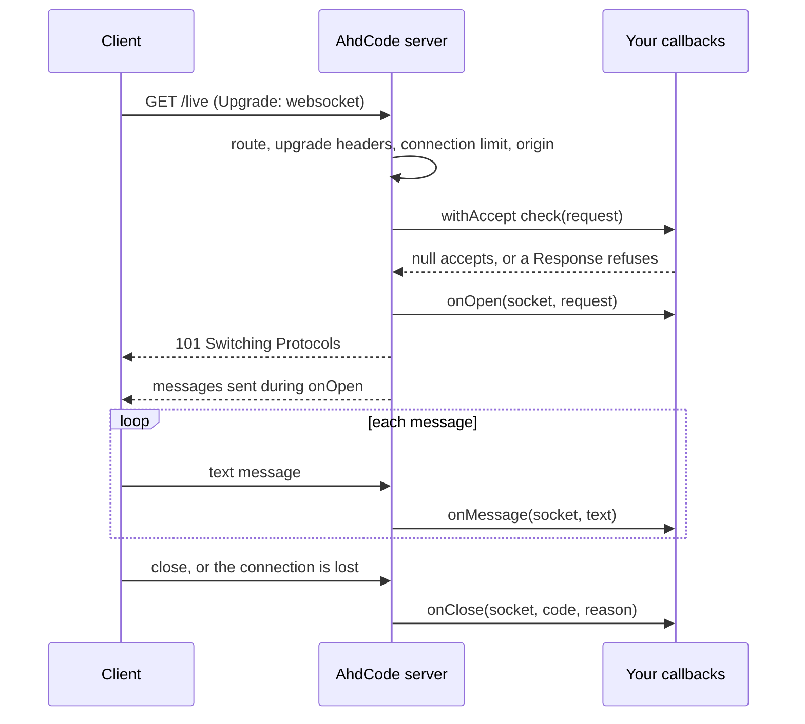

# WebSocket

[English] · Türkçe

[Back to README](README.md) · [HTTP](HTTP.md) · [Web](WEB.md) · [Security](SECURITY.md) · [Env](ENV.md)

AhdCode v1.4.0 adds WebSocket **server** endpoints to the [HTTP](HTTP.md)
module, with a small pass-through in [Web](WEB.md). An endpoint lives on the
same `Server` as your routes, shares its handler mutex and lifecycle, and
exchanges text messages with browsers and other clients. There is no
WebSocket client in v1.4.0.

The protocol is implemented by `github.com/coder/websocket` v1.8.15, vendored
into AhdCode. Only a program that creates an endpoint receives it, and the
build stays offline.

## Public surface

```text
HTTP.websocket(onMessage: Function(WebSocket, String) -> Nothing) -> WebSocketEndpoint

WebSocketEndpoint.withOpen(handler: Function(WebSocket, Request) -> Nothing)      -> WebSocketEndpoint
WebSocketEndpoint.withClose(handler: Function(WebSocket, Int, String) -> Nothing) -> WebSocketEndpoint
WebSocketEndpoint.withAccept(check: Function(Request) -> Response?)               -> WebSocketEndpoint
WebSocketEndpoint.withAllowedOrigins(origins: List<String>)                       -> WebSocketEndpoint
WebSocketEndpoint.withMaxMessageBytes(bytes: Int)                                 -> WebSocketEndpoint
WebSocketEndpoint.withMaxQueuedMessages(count: Int)                               -> WebSocketEndpoint
WebSocketEndpoint.withMaxConnections(count: Int)                                  -> WebSocketEndpoint

Server.websocket(path: String, endpoint: WebSocketEndpoint) -> Nothing

WebSocket.id()                                           -> String
WebSocket.send(text: String)                             -> Bool
WebSocket.close(code: Int := 1000, reason: String := "") -> Nothing
WebSocket.isOpen()                                       -> Bool

Web.websocket(onMessage: Function(WebSocket, String) -> Nothing) -> WebSocketEndpoint
App.websocket(path: String, endpoint: WebSocketEndpoint)         -> Nothing
```

`Web` re-exports `WebSocket` and `WebSocketEndpoint`. A `WebSocketEndpoint`
is immutable configuration, like `Cookie`: each `with…` returns a new one, and
it holds no live connections. `WebSocket.id()` is an opaque identifier that is
unique in the process and never reused.

## A first endpoint

```ahd
bring HTTP
bring KeyValue
from HTTP bring (Server, Request, WebSocket, WebSocketEndpoint)

clients: Pair<String, WebSocket> := {}

joined: Function := (socket: WebSocket, request: Request) -> Nothing {
    clients: Global Pair<String, WebSocket>
    clients[socket.id()] = socket
}

received: Function := (socket: WebSocket, text: String) -> Nothing {
    socket.send("echo: " + text)
}

left: Function := (socket: WebSocket, code: Int, reason: String) -> Nothing {
    clients: Global Pair<String, WebSocket>
    clients = KeyValue.without(clients, socket.id())
}

endpoint: WebSocketEndpoint := HTTP.websocket(received)
endpoint = endpoint.withOpen(joined)
endpoint = endpoint.withClose(left)

server: Server := HTTP.server("127.0.0.1", 8172)
server.websocket("/live", endpoint)
server.start()
```

Register endpoints before `start()`. A path cannot be both a WebSocket endpoint
and a `GET` route; either mistake raises `HTTPError`. A non-`GET` request to an
endpoint path is answered `405` with `Allow`.

## Lifecycle



The opening handshake runs its checks in this order:

1. The path matches an endpoint, with the same rules as HTTP routes.
2. Upgrade headers. A request that is not an upgrade attempt gets
   `426 Upgrade Required`; a malformed one gets `400`.
3. The connection limit. When it is reached: `503`.
4. The origin policy. When it fails: `403`.
5. The `withAccept` check, if any. A returned `Response` is sent as it is and
   no upgrade happens; `null` continues. An error raised in the check is a
   `500` and is logged like a handler failure.
6. `onOpen(socket, request)`. It runs **before** the upgrade response, so by
   the time the client sees the connection open, your `onOpen` has returned
   and the socket is in your registry. Messages sent from `onOpen` are
   delivered first.
7. `101 Switching Protocols`. If the upgrade fails after `onOpen`,
   `onClose(socket, 1006, "")` still runs.

For each socket, `onOpen` runs exactly once and first, `onMessage` runs once
per message in arrival order, and `onClose` runs exactly once and last. A
refused handshake runs none of them.

## Callbacks run one at a time

Every WebSocket callback holds the **same** per-server mutex as HTTP
handlers. No two handlers or callbacks on one `Server` ever run at the same
time. That is why the registry above can be an ordinary `Pair` with no
locking.

It also means a slow callback delays every request and every other socket,
exactly like a slow handler. Keep callbacks short. A database query in a
callback is fine; waiting on something slow is not.

The next message from a client is read only after `onMessage` for the
previous one has returned, so a slow application slows that client down
instead of growing a hidden queue.

## Sending and broadcasting

`send` never blocks. It puts the message on a bounded queue for that socket
and returns `true`, or returns `false` when the socket is closed or closing.
When the queue is full, the socket is closed with `1008` and the reason
`outbound queue full`, and `send` returns `false`: a client that cannot keep
up is disconnected rather than allowed to grow memory.

Broadcasting is application code over your own registry:

```ahd
broadcast: Function := (text: String) -> Int {
    clients: Global Pair<String, WebSocket>
    delivered: Local Int := 0
    for socket in KeyValue.values(clients) {
        if socket.send(text) {
            delivered += 1
        }
    }
    return delivered
}
```

An HTTP handler may call `broadcast`, because it holds the same mutex.

## Messages

- Only text messages are supported. A binary message closes the socket with
  `1003`.
- Text must be valid UTF-8; otherwise the socket closes with `1007`.
- A message larger than `maxMessageBytes` closes the socket with `1009`.
  Fragmented messages are reassembled up to that limit.
- Message contents are never logged.

To send structured data, build it with [JSON](JSON.md) and send the String.

## Closing

`close(code, reason)` accepts `1000`, `1001`, `1008`, `1011`, and
`3000..4999`, with a reason of at most 123 bytes of UTF-8; anything else raises
`HTTPError`. Closing a socket that is already closed or closing does nothing.
Messages already queued are sent before the close frame. `close` inside a
callback does not call `onClose` from within that callback; `onClose` runs
after the current callback returns. The close handshake waits at most five
seconds.

`onClose` receives the code and reason of the side that closed first. A lost
connection, a ping timeout, or a stalled write reports `1006` with an empty
reason; `1006` is never sent on the wire. After `onClose` starts, `isOpen()` is
`false` and `send` returns `false`.

An error raised in `onOpen` or `onMessage` is written to stderr, never to the
client; the socket is closed with `1011` and `onClose` still runs. An error in
`onClose` is only logged. The server keeps serving. A disconnect is not an
`HTTPError`.

Ending the process — Ctrl+C, `ahdcode kill`, or a `dev` rebuild — drops
connections without close frames. There is no automatic reconnection on
either side: a browser page reconnects only if its own script does.

## Keeping connections alive

The server pings every connection every 30 seconds. A client that does not
answer within 30 seconds is closed as `1006`. Client pings are answered.
Each outgoing message has a 10-second write deadline. The HTTP server's own
read and write timeouts do not apply to an upgraded connection, so a socket
stays open as long as the client does.

## Security

### Origins

Browsers send an `Origin` header, and a page on another site can try to open
your endpoint with the user's cookies. The default policy is same-origin:

- No `Origin` header is allowed; that is a non-browser client.
- Otherwise the `Origin` host, including a non-default port, must equal the
  request's `Host`, ignoring case.

`withAllowedOrigins(["https://app.example.com"])` replaces the default with an
exact list of `scheme://host[:port]` values, compared after lowercasing. There
are no wildcards and no paths; `"*"`, an empty list, or a malformed origin
raises `HTTPError` when you configure it.

### Authentication

Authenticate before the upgrade with `withAccept`:

```ahd
accept: Function := (request: Request) -> Response? {
    session: Local Session := sessions.open(request)
    if session.get("user_id") == null {
        return HTTP.text("sign in first", 401)
    }
    return null
}
endpoint = endpoint.withAccept(accept)
```

Sessions can be read in `withAccept` and `onOpen`. There is no response to
commit there, so changing the session in those callbacks is not supported.
For machine-to-machine use, a bearer token checked with
`request.header("Authorization")`, [`Env.secret`](ENV.md), and
[`Security.secureEqual`](SECURITY.md) works the same way.

### Limits

| Setting | Default | Range | When exceeded |
| --- | --- | --- | --- |
| `withMaxMessageBytes` | 65536 | `1..16777216` | close `1009` |
| `withMaxQueuedMessages` | 64 | `1..4096` | close `1008`, `outbound queue full` |
| `withMaxConnections` | 1024 | `1..1000000` | handshake `503` |

A value outside its range raises `HTTPError`. Compression is disabled.

## Using Web

```ahd
bring Web
from Web bring (App, WebSocket)

echo: Function := (socket: WebSocket, text: String) -> Nothing {
    socket.send(text)
}

site: App := Web.start()
site.websocket("/live", Web.websocket(echo))
site.start()
```

`App.websocket` registers the endpoint on the application's server, under the
same configuration and limits as its routes. Endpoints cannot be registered
on a `RouteSet` or `RouteGroup`: guards and `RequestContext.respond` produce an
HTTP response, which an upgraded connection cannot use. Put the same policy
in `withAccept` instead. The
realtime attendance example
shows a complete application.

## Behind a reverse proxy

A reverse proxy must pass the upgrade through and should keep the original
`Host`, which the same-origin check compares against.

nginx:

```nginx
location /live {
    proxy_pass http://127.0.0.1:8140;
    proxy_http_version 1.1;
    proxy_set_header Upgrade $http_upgrade;
    proxy_set_header Connection "upgrade";
    proxy_set_header Host $host;
    proxy_read_timeout 120s;
}
```

Caddy's `reverse_proxy` passes WebSocket upgrades through without extra
settings. Keep any proxy idle timeout above the 30-second ping interval. When
the proxy terminates TLS, browsers connect with `wss://` to the proxy.

## Non-goals

Not in v1.4.0: a WebSocket client, binary messages, subprotocols,
compression, endpoints on `RouteSet` / `RouteGroup`, a graceful `1001` on
shutdown, automatic reconnection, and a publish/subscribe or event bus layer.

See also: `examples/v0.1/72_websocket_echo.ahd` ·
`examples/v1.4/realtime_attendance` ·
[HTTP](HTTP.md) · [Web](WEB.md).
